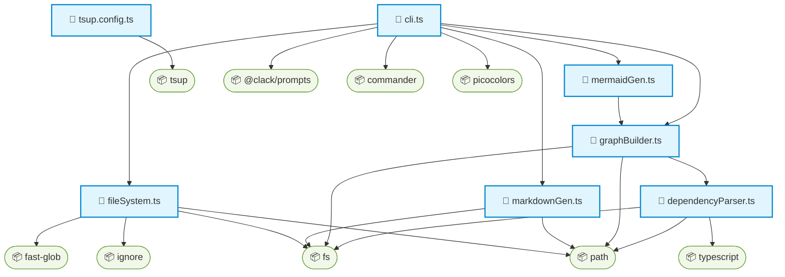

<div align="center">
  
  <h1>CodeAtlas ✨</h1>
  <p><strong>Automatically generate beautiful architecture documentation for your codebase in seconds.</strong></p>
  
  <p>
    <a href="https://github.com/yourusername/code-atlas/stargazers"></a>
    <a href="https://www.npmjs.com/package/code-atlas"></a>
    <a href="https://github.com/yourusername/code-atlas/blob/main/LICENSE"></a>
  </p>
</div>

---

## 🌟 Why CodeAtlas?

Tired of jumping into a new codebase and having no idea how files connect? **CodeAtlas** is a zero-config CLI tool that instantly scans your JavaScript/TypeScript project, extracts dependencies, and generates a stunning **Mermaid.js architecture diagram** natively rendered in Markdown.

- 🚀 **Zero Config**: Just run it. It respects your `.gitignore` out of the box.
- 💅 **Beautiful CLI**: Built with `@clack/prompts` for a buttery-smooth terminal experience.
- 📊 **Native GitHub Support**: Generates Markdown files with Mermaid graphs that GitHub renders natively.
- ⚡ **Lightning Fast**: Powered by `ts-morph` and `fast-glob`, analyzing hundreds of files in milliseconds.

## 📦 Quick Start

You don't even need to install it! Just use `npx` in the root of any JS/TS project:

```bash
npx code-atlas generate
```

*(Alternatively, install it globally)*
```bash
npm i -g code-atlas
code-atlas generate
```

## 🛠️ How it works

1. **Scan**: CodeAtlas traverses your working directory, finding all `.js`, `.ts`, `.jsx`, and `.tsx` files, completely ignoring paths specified in your `.gitignore` and `node_modules`.
2. **Parse**: It parses the AST of your files to find all ES Modules `import` and CommonJS `require` calls.
3. **Graph**: It builds a complete directed graph of internal and external dependencies.
4. **Output**: It generates a `docs/architecture.md` file containing a gorgeous Mermaid graph.

## 🎨 Example Output

Here is what CodeAtlas generates for its own codebase:



## 🤝 Contributing
PRs are welcome! Feel free to open an issue to discuss new features or submit a pull request.

## 📄 License
MIT © CodeAtlas
